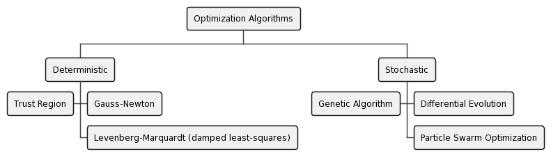

# minimacore

MinimaCore is an open-source modern C++ optimization library (C++20 or later).

# Authors

The library was conceptualized by Ariel Avi and Pedro Stella. Any contribution is encouraged.

# Getting Started

## The library

We've conceptualized this library because we felt the lack of some open-source optimization libraries, especially in
modern C++.

An overview of the algorithms available in this library is given below*:

(*) Not all algorithms stated above are implemented at the time of this writing

## Using the library

Targets in MinimaCore follow the naming convention:

`minimacore::<ALGORITHM_NAME>`

Replace `<ALGORITHM_NAME>` with the algorithm you wish to use (follow the naming convention in the `src/` folder). This
target is an alias to an interface target that includes the library's headers. Specialized targets (with defined
floating-point types) will be introduced in the future

Currently available targets:

`minimacore::genetic_algorithm` (incomplete)

## Dependencies

### C++20 capable compiler

This library uses [concepts](https://en.cppreference.com/w/cpp/language/constraints) (C++20), therefore, it is required
that your compiler is C++20-capable.

### CMake

This project is CMake based, therefore, users are encouraged to use CMake when using the library as well.

### Google Test

MinimaCore uses [Google Test](https://github.com/google/googletest) as unit testing framework. Sources for unit testing
can be found at [tests/src](tests/src).

### Google Benchmark

Together with Google Test, MinimaCore uses Google Benchmark as the micro benchmark library. This is only required to
compile and run smaller scripts that compare different approaches to the same problem.

### Eigen3

We decided to use Eigen3 as the matrix and vector operation calculations. Some reasons:

1. Eigen is open-source
2. Eigen is one of the [fastest and most efficient](https://eigen.tuxfamily.org/index.php?title=Benchmark) BLAS C++
   libraries
3. There are many
   [enterprise-level projects using Eigen](https://eigen.tuxfamily.org/index.php?title=Main_Page#Projects_using_Eigen)
4. It works with any floating point type

# How to contribute

Anyone is encouraged to contribute, that is with algorithms, CMake scripts or case studies.

- Please refer and always use [C++ Core Guidelines](https://isocpp.github.io/CppCoreGuidelines/CppCoreGuidelines).
- We target a code coverage of 100%, despite knowing that sometimes that is utopian.
- Code Style: code-style consistency is important to keep a sense of freshness in the library.
    - If you use JetBrains IDEs, you can import the code style from [resources](resources/minimacore-code-style.xml)