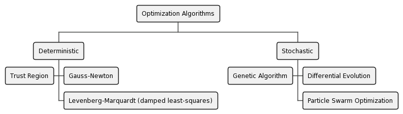

# MinimaCore

**A modern C++ library for continuous-domain numerical optimization.**

MinimaCore provides a clean, composable API for solving optimization problems over continuous search spaces. Algorithms share a common design so you can swap between methods without rewriting your problem definition.

[](https://github.com/ariel-avi/minimacore/actions/workflows/tests.yml)

---

## Why MinimaCore?

Most optimization libraries are either too narrow (single algorithm, fixed types) or too complex (convoluted APIs, heavy frameworks). MinimaCore is built around a few principles:

- **Consistent API across algorithms** — switching from Genetic Algorithm to Differential Evolution or PSO requires changing as little code as possible
- **Type-generic** — all algorithms are templated on floating-point type (`float`, `double`, `long double`), letting you trade precision for performance where it matters
- **Parallel by default** — population evaluation runs on a thread pool; parallel STL execution policies are used when available
- **Header-only** — no linking required, just include and go
- **Modern C++** — built on C++23 concepts and standard library features

---

## Algorithms



> Not all algorithms shown above are implemented yet.

### Currently available

| Algorithm | CMake target | Status |
|---|---|---|
| Genetic Algorithm | `minimacore::genetic_algorithm` | In progress |

---

## Genetic Algorithm

The GA implementation is fully configurable through a fluent `setup` object. Here is what it looks like:

```cpp
#include <genetic_algorithm/setup.h>
#include <genetic_algorithm/runner.h>

// 1. Define your objective function
class my_evaluation : public minimacore::genetic_algorithm::base_evaluation<double> {
public:
    size_t operator()(base_individual<double>& individual, size_t idx) const override {
        // write your fitness value(s) into the individual starting at idx
        individual.set_objective_fitness(idx, /* your function */ 0.0);
        return idx + objective_count();
    }
    size_t objective_count() const override { return 1; }
};

// 2. Configure the algorithm
auto s = minimacore::genetic_algorithm::setup<double>{}
    .set_population_size(200)
    .set_generations(500)
    .set_genome_generator(std::make_unique<my_genome_generator>())
    .set_selection_for_reproduction(
        std::make_unique<tournament_selection_for_reproduction<double>>(5, 100))
    .set_selection_for_replacement(
        std::make_unique<generational_selection_for_replacement<double>>())
    .set_crossover(std::make_unique<uniform_linear_crossover<double>>(0.5))
    .set_mutation(std::make_unique<gaussian_mutation<double>>(0.1, 0.5))
    .add_evaluation(std::make_unique<my_evaluation>());

// 3. Run
minimacore::genetic_algorithm::runner<double> r(std::move(s));
r.add_log_stream(std::cout);
r.run();

auto& best = r.get_best_individual();
```

### Selection operators

| Operator | Type | Class |
|---|---|---|
| Truncation | Reproduction | `truncation_selection_for_reproduction` |
| Tournament | Reproduction | `tournament_selection_for_reproduction` |
| Ranked (Pareto) | Reproduction | `ranked_selection_for_reproduction` |
| Generational | Replacement | `generational_selection_for_replacement` |
| Truncation | Replacement | `truncation_selection_for_replacement` |
| Ranked (Pareto) | Replacement | `ranked_selection_for_replacement` |

### Crossover operators

| Class | Description |
|---|---|
| `uniform_linear_crossover` | Blends two parents along the line connecting them |
| `uniform_voluminal_crossover` | Blends each genome dimension independently |

### Mutation operators

| Class | Description |
|---|---|
| `gaussian_mutation` | Adds Gaussian noise to each gene |
| `uniform_mutation` | Perturbs each gene by a scaled uniform random offset |

### Termination conditions

Multiple conditions can be combined; the algorithm stops when any one is met.

| Class | Stops when |
|---|---|
| `generation_termination` | Generation count reaches the limit (always active) |
| `best_fitness_termination` | Best individual fitness drops below a threshold |
| `average_fitness_termination` | Average population fitness drops below a threshold |
| `selection_pressure_termination` | Selection pressure exceeds a threshold |

### Runtime control

The runner supports pause, resume, and stop from any thread:

```cpp
r.pause();   // suspends at the end of the current generation
r.resume();  // continues
r.stop();    // terminates cleanly after the current generation
```

### Statistics and export

After running, per-generation statistics can be exported to CSV:

```cpp
r.export_statistics("stats.csv", ',');
```

---

## Integration

MinimaCore is header-only. Add the repository as a subdirectory or install it, then link against the target for the algorithm you need:

```cmake
target_link_libraries(my_target PRIVATE minimacore::genetic_algorithm)
```

---

## Building from source

### Requirements

| Dependency | Version | Purpose |
|---|---|---|
| C++ compiler | C++23 | Required |
| CMake | ≥ 3.25 | Build system |
| Conan | ≥ 2.0 | Dependency manager |

Install Conan if you don't have it:

```shell
pip install conan
```

### Step 1 — Install dependencies

**Linux / macOS**

```shell
conan install . --build=missing -s build_type=Release
```

```shell
conan install . --build=missing -s build_type=Debug
```

**Windows (MSVC)**

Run both configurations separately so both Debug and Release packages are available:

```commandline
conan install . --build=missing -s build_type=Release
conan install . --build=missing -s build_type=Debug
```

### Step 2 — Configure and build

Conan generates CMake presets automatically. Use them directly:

**Release**

```shell
cmake --preset conan-release
cmake --build --preset conan-release
```

**Debug**

```shell
cmake --preset conan-debug
cmake --build --preset conan-debug
```

**Windows (MSVC) — manual toolchain**

If presets are unavailable, pass the toolchain file explicitly:

```commandline
cmake .. -DCMAKE_TOOLCHAIN_FILE=build/Release/generators/conan_toolchain.cmake -G "Visual Studio 17 2022"
cmake --build . --config Release
```

---

## Running the tests

Tests are built automatically when Google Test is found (it is managed by Conan). After building, run them with CTest:

```shell
ctest --preset conan-release   # Release
ctest --preset conan-debug     # Debug
```

Or run the test binary directly:

```shell
./build/Release/minimacore_tests
./build/Debug/minimacore_tests
```

---

## Examples

| Example | Description |
|---|---|
| [Rastrigin Function](examples/benchmark_functions/rastrigin/rastrigin.md) | Minimizing a multimodal benchmark function with many local minima |

---

## Contributing

Contributions are welcome — algorithms, CMake improvements, examples, and case studies.

- Follow the [C++ Core Guidelines](https://isocpp.github.io/CppCoreGuidelines/CppCoreGuidelines)
- Target 100% unit test coverage for new code
- Keep code style consistent — JetBrains IDE users can import the style from [resources/minimacore-code-style.xml](resources/minimacore-code-style.xml)

---

## Authors

Conceptualized by Ariel Avi and Pedro Stella.
