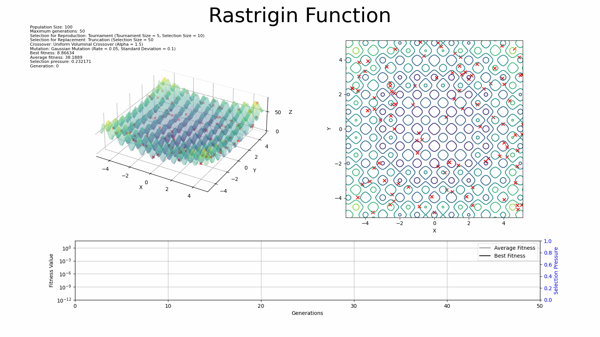

# Rastrigin - Optimization Example

This example shows how to find the global minima for the Rastrigin function. The Rastrigin function has the boundaries
[-5.12, 5.12] and is composed by many local minima, but only one global minimum located at (0, 0, ...).

## Running the example

To run the example, compile the example target

```shell
mkdir build
cd build
cmake .. --target=minimacore_example_rastrigin
cmake --build .
./bin/minimacore_example_rastrigin
```

The above command will generate three files, one containing the baseline function values in a mesh grid
style (`rastrigin.csv`), another one containing the evolution results of the
population (`rastrigin_population_evolution.txt`), and the last one contains the evolution
statistics (`rastrigin_statistics.csv`).

To process that data and create an animation, just run:

```shell
python -m <path/to>/evolution_plot.py
```

Then you will have an animation that looks like the following:

